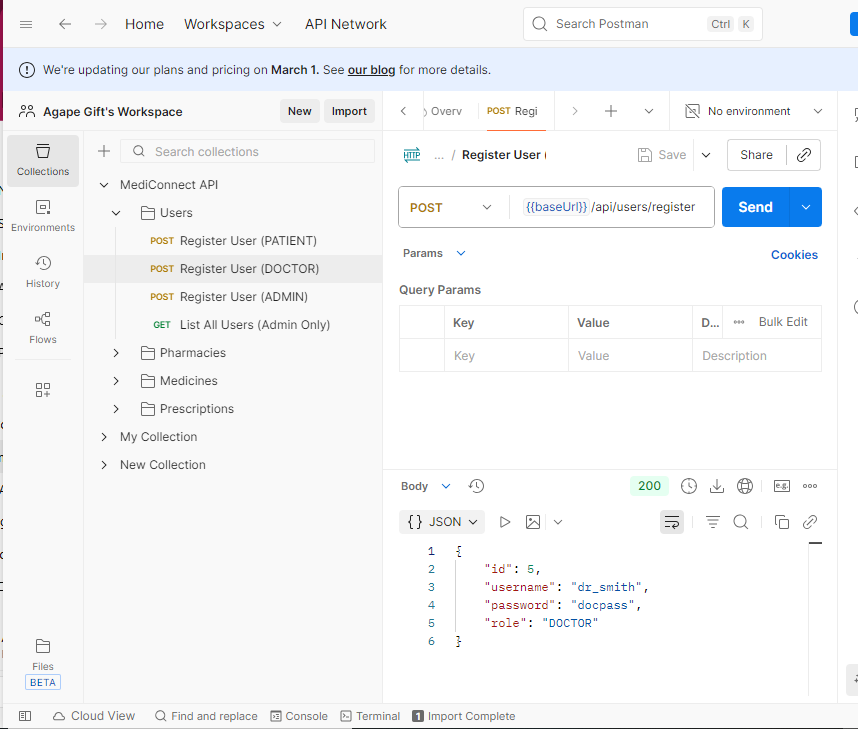

# MediConnect RW

A simple RESTful backend for prescription verification and pharmacy stock tracking.

## Features

- Role-based endpoints (admin, doctor, pharmacy, patient) using header `X-Role`
- H2 in-memory database; no setup required
- Entities: User, Prescription, Medicine, Pharmacy, Stock

## Running

1. Install Java 17 and Maven on your machine.
2. Open a terminal in `mediconnect` directory.
3. Run `mvn spring-boot:run`.
4. The API will be available at `http://localhost:8080`.
5. H2 console available at `http://localhost:8080/h2-console` (jdbc url `jdbc:h2:mem:testdb`).

## Sample API calls (use Postman or curl)

### Register as patient
```
POST /api/users/register
Content-Type: application/json

{"username":"alice","password":"pass"}
```

### Create a doctor (admin only)
```
POST /api/users/register
X-Role: ADMIN
{"username":"drbob","password":"doc","role":"DOCTOR"}
```

### Doctor issues prescription
```
POST /api/prescriptions
X-Role: DOCTOR
{"doctorName":"drbob","patientName":"alice","medication":"Paracetamol","notes":"Take twice a day"}
```

### Pharmacy registers and updates stock
```
POST /api/pharmacies
{"name":"Pharma1","address":"Kigali"}

POST /api/pharmacies/1/stock?medicineId=1&quantity=100
X-Role: PHARMACY
```

### List all pharmacies
```
GET /api/pharmacies
```

## Screenshots
Below are sample application screens from the `testing-screenshots` folder in this repository.





See code comments for more details.
